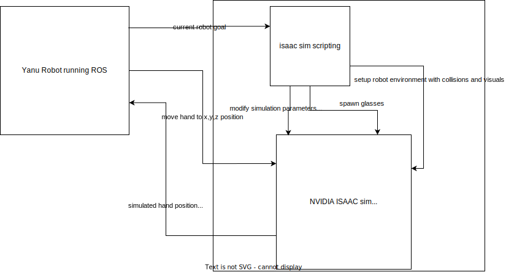

*This is a template repository for this organization. Start by replacing the placeholder for the project name with it's actual title.*

# [Demonstration Project title]

## Summary

| Company | [Yanu](https://yanu.ai/) |
| :--- | :--- |
| Project Manager | [Project Manager TODO](https://profile.link) |
| Project Team | [Kristjan Laht](https://github.com/KingBoomie); [Houman Masnavi](https://www.linkedin.com/in/houman-masnavi/?originalSubdomain=ee) |
| Challenge Tackled | 3d model optimization;  |
| Technology Used | nvidia isaac robot simulator |

## Objectives of the Demonstration Project
The objective of this project is to develop an N-dimensional digital twin for YANU robotic cells. The digital twin is expected to provide validation of new algorithms in a safe way, thus reducing potential system downtime, and model-based testing of full systems integrations and its upgrades before deployment on the live system.

## Activities and results of demonstration project
*Challenge addressed (i.e. whether and how the initial challenge was changed during the project, for which investment the demonstration project was provided)*
- The project addresses the challenge of improving the effectiveness of the product manufacturing process by leveraging data-driven artificial intelligence approaches and streamlining the development of dynamically modular design of Yanu robot cell.

*Data sources (which data was used for the technological solution)*
- Openly available physical models of the Panda robot arm and proprietary model of the Yanu workspace / robot.  

*Description and justifictaion of used AI technology*
- Path planning, collision algorithms and physical simulations were used to test the robot in a simulated environment. 

*Results of testing and validating technological solution*
- 

*Technical architecture (presented graphically, where can also be seen how the technical solution integrates with the existing system)*

- The technical architecture involves a photorealistic physics-based simulation environment (NVIDIA Omniverse Isaac Sim) that integrates with the main software backbone (ROS). 

*Potential areas of use of technical solution*
- 

*Lessons learned (i.e. assessment whether the technological solution actually solved the initial challenge)*
- 

### Description of User Interface 
*(i.e. How does the client 'see' the technical result, whether a separate user interface was developed, command line script was developed, was it validated as an experiment, can the results be seen in ERP or are they integrated into work process)*
- 

## Custom agreement with the AIRE team

*If you have a unique project or specific requirements that don't fit neatly into the Docker file or description template options, we welcome custom agreements with our AIRE team. This option allows flexibility in collaborating with us to ensure your project's needs are met effectively.*

*To explore this option, please contact our demonstration projects service manager via katre.eljas@taltech.ee with the subject line "Demonstration Project Custom Agreement Request - [Your Project Name]." In your email, briefly describe your project and your specific documentation or collaboration needs. Our team will promptly respond to initiate a conversation about tailoring a solution that aligns with your project goals.*

